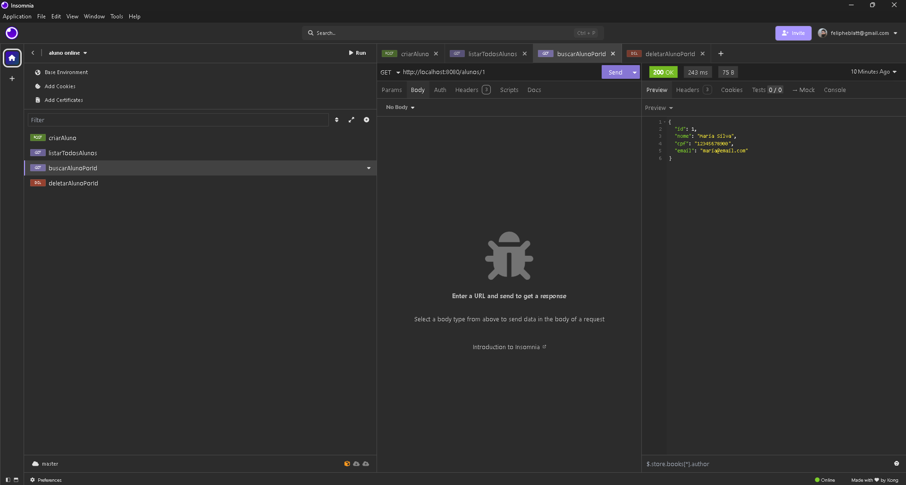
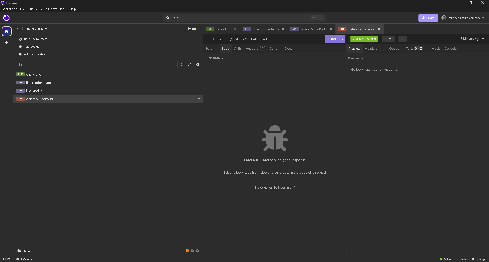
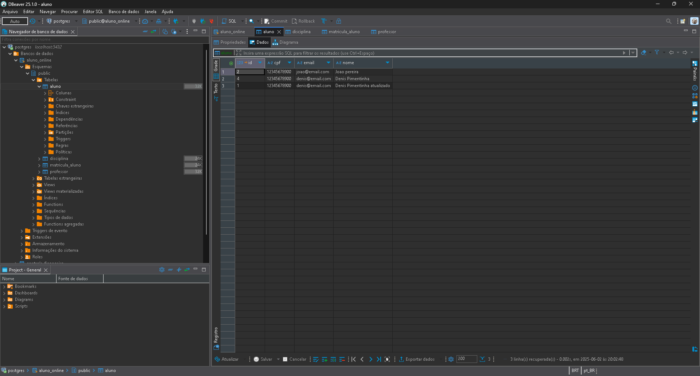
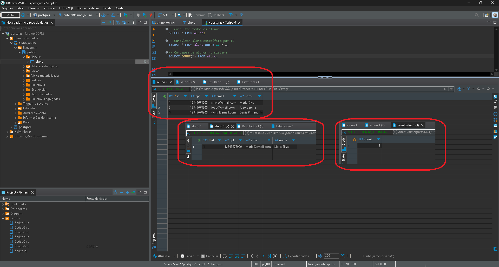

# api-aluno-online
 
# API de Gerenciamento de Alunos

Este projeto implementa uma API REST para gerenciamento de alunos utilizando Spring Boot.

## Tecnologias Utilizadas

- Java
- Spring Boot
- Spring Data JPA
- Maven
- Lombok
- PostgreSQL
- Insomnia
- DBeaver

## Estrutura do Projeto

O projeto segue uma arquitetura em camadas:

- **Model**: Entidades JPA que representam as tabelas do banco de dados
- **Repository**: Interfaces que estendem JpaRepository para operações de persistência
- **Service**: Classes que implementam a lógica de negócio
- **Controller**: Endpoints REST que recebem as requisições HTTP

## Como Executar

1. Clone o repositório
2. Configure o banco de dados no arquivo `application.properties` localizado em `resources`
3. Execute o comando: `mvn spring-boot:run`

## Pré-requisitos

- Java 17+
- Maven 3.6+
- PostgreSQL 12+
- Insomnia (para testes de API)
- DBeaver (para visualização do banco de dados)

## Funcionalidades

### Aluno

O sistema permite as seguintes operações para a entidade Aluno:

- **Criar Aluno**: Cadastro de novos alunos no sistema com nome, CPF e email
- **Listar Alunos**: Visualização de todos os alunos cadastrados
- **Buscar Aluno**: Consulta de detalhes de um aluno específico pelo ID
- **Remover Aluno**: Exclusão de um aluno pelo seu ID

### Endpoints

#### Alunos

- **POST** `/alunos`: Cria um novo aluno
  - Body:
  ```json
  {
    "nome": "Nome do Aluno",
    "cpf": "12345678900",
    "email": "aluno@email.com"
  }
  ```
  - Response: Status 201 (Created)
  

- **GET** `/alunos`: Lista todos os alunos cadastrados
  - Response: Status 200 (OK)
  ```json
  [
    {
      "id": 1,
      "nome": "Nome do Aluno",
      "cpf": "12345678900",
      "email": "aluno@email.com"
    }
  ]
  ```

- **GET** `/alunos/{id}`: Busca um aluno pelo ID
  - Response: Status 200 (OK)
  ```json
  {
    "id": 1,
    "nome": "Nome do Aluno",
    "cpf": "12345678900", 
    "email": "aluno@email.com"
  }
  ```

- **DELETE** `/alunos/{id}`: Remove um aluno pelo ID
  - Response: Status 204 (No Content)

# Exemplos de Uso

## Testando a API com Insomnia

### Criação de Aluno (POST)


Nesta imagem, vemos a requisição POST para `/alunos` com o seguinte corpo:
```json
{
  "nome": "Denis Pimentinha",
  "cpf": "12345678900",
  "email": "denis@email.com"
}
```

O servidor retorna o status HTTP 201 (Created), confirmando o sucesso da operação.

### Listagem de Alunos (GET)


A requisição GET para `/alunos` retorna todos os alunos cadastrados no sistema com status 200 (OK).

### Busca de Aluno por ID (GET)


Ao fazer uma requisição GET para `/alunos/1`, recebemos os detalhes do aluno com ID 1.

### Remoção de Aluno (DELETE)


A requisição DELETE para `/alunos/1` remove o aluno e retorna status 204 (No Content).

## Visualização no Banco de Dados (DBeaver)

### Tabela de Alunos


Nesta captura, podemos ver a tabela `aluno` no banco de dados PostgreSQL contendo os registros inseridos através da API. Os campos `id`, `nome`, `cpf` e `email` são exibidos com os valores correspondentes.

### Consulta SQL

Exemplo de consultas SQL executadas no DBeaver:

```sql
-- Consultar todos os alunos
SELECT * FROM aluno;

-- Consultar aluno específico por ID
SELECT * FROM aluno WHERE id = 1;

-- Contagem de alunos no sistema
SELECT COUNT(*) FROM aluno;
```



## Observações

- As capturas de tela demonstram o fluxo completo desde a requisição HTTP até o armazenamento no banco de dados
- A estrutura da tabela no PostgreSQL reflete exatamente o modelo definido na classe `Aluno.java`
- As operações CRUD são realizadas com sucesso através da API
- O banco de dados mantém a integridade dos dados conforme esperado

## Autor
<div>
  </img>
  
  [Feliphe-Blatt](https://github.com/Feliphe-Blatt)
</div>

## Professor
<div>
  </img>
  
[Kelson Victor](https://github.com/kelsonvictr)
</div>